# EduIntel — Database Design & Architecture Specification

## 1. System Overview & Data Architecture

EduIntel employs a **Hybrid Polyglot Data Architecture** designed for AI-integrated educational ERP systems. Data persistence is decoupled across four core storage engines:

```
                                  ┌─────────────────────────┐
                                  │   EduIntel FastAPI      │
                                  │   Backend Application   │
                                  └────────────┬────────────┘
                                               │
          ┌──────────────────────┬─────────────┼──────────────┬──────────────────────┐
          │                      │             │              │                      │
          ▼                      ▼             ▼              ▼                      ▼
┌──────────────────┐  ┌──────────────────┐  ┌──────────┐  ┌───────────────┐  ┌─────────────────┐
│ PostgreSQL RDBMS │  │ ChromaDB Vector  │  │ MLflow   │  │ File Storage  │  │ Redis (Cache)   │
│ (Primary Data)   │  │ (RAG & Semantic) │  │ Tracking │  │ (PDF/OCR/Img) │  │ (Session/State) │
└──────────────────┘  └──────────────────┘  └──────────┘  └───────────────┘  └─────────────────┘
```

1. **Relational Database (PostgreSQL / SQLAlchemy 2.0 Async)**: Core domain entities, user identity, role profiles, academic records, finance, schedules, audit logs, and LLM telemetry.
2. **Vector Database (ChromaDB - Persistent)**: Semantic vector embeddings generated via Google Gemini Embedding API (`gemini-embedding-001`) for Study Materials and Portal Help Documents.
3. **MLflow SQLite Database (`mlflow.db`)**: ML model registry, metrics, parameters, and model artifacts tracking for student at-risk diagnostic models.
4. **Blob / Local File Storage (`backend/uploads/`)**: Physical PDF uploads, homework submission attachments, and OCR raw text extractions.

---

## 2. Entity-Relationship Diagram (ERD)

```mermaid
erDiagram
    users ||--o| student_profiles : "has"
    users ||--o| teacher_profiles : "has"
    users ||--o| admin_profiles : "has"
    users ||--o{ password_reset_tokens : "requests"
    
    users ||--o{ assignments : "creates (Teacher)"
    users ||--o{ study_materials : "uploads (Teacher)"
    users ||--o{ exam_results : "takes (Student)"
    users ||--o{ exam_results : "enters (Teacher/Admin)"
    
    users ||--o{ homework_submissions : "submits (Student)"
    users ||--o{ homework_submissions : "grades (Teacher)"
    
    users ||--o{ doubt_threads : "opens (Student)"
    doubt_threads ||--o{ doubt_messages : "contains"
    users ||--o{ doubt_messages : "sends"
    
    users ||--o{ timetable_entries : "assigned_teacher"
    users ||--o{ timetable_entries : "created_by"
    
    users ||--o{ salary_records : "receives (Teacher)"
    users ||--o{ salary_records : "created_by"
    
    users ||--o{ fee_records : "owes (Student)"
    users ||--o{ attendance_records : "recorded_for (Student)"
    users ||--o{ attendance_records : "marked_by (Teacher/Admin)"
    
    users ||--o{ audit_logs : "triggers"

    users {
        uuid id PK
        string email UK
        string name
        string hashed_password
        enum role "student|teacher|admin"
        boolean is_active
        timestamp created_at
        timestamp updated_at
    }

    student_profiles {
        uuid id PK
        uuid user_id FK,UK
        string grade
        string section
        string roll_number
        string parent_email
        string phone
        string address
        string guardian_name
        string guardian_phone
        timestamp created_at
        timestamp updated_at
    }

    teacher_profiles {
        uuid id PK
        uuid user_id FK,UK
        string subjects
        string department
        timestamp created_at
        timestamp updated_at
    }

    admin_profiles {
        uuid id PK
        uuid user_id FK,UK
        string designation
        timestamp created_at
        timestamp updated_at
    }

    password_reset_tokens {
        uuid id PK
        uuid user_id FK
        string token UK
        timestamp expires_at
        boolean used
        timestamp created_at
        timestamp updated_at
    }

    announcements {
        uuid id PK
        string title
        text body
        string posted_by
        timestamp created_at
        timestamp updated_at
    }

    assignments {
        uuid id PK
        string title
        string subject
        string class_section
        date due_date
        int max_score
        text instructions
        uuid created_by FK
        timestamp created_at
        timestamp updated_at
    }

    study_materials {
        uuid id PK
        uuid teacher_id FK
        string subject
        string title
        text description
        string file_path
        string original_filename
        text extracted_text
        string extraction_method
        timestamp created_at
        timestamp updated_at
    }

    exam_results {
        uuid id PK
        uuid student_id FK
        string class_section
        string subject
        string topic
        date exam_date
        decimal score
        decimal max_score
        uuid entered_by FK
        timestamp created_at
        timestamp updated_at
    }

    homework_submissions {
        uuid id PK
        uuid student_id FK
        string subject
        string title
        text description
        string file_path
        string original_filename
        enum status "submitted|graded"
        int score
        int max_score
        text feedback
        uuid graded_by FK
        text extracted_text
        float ocr_confidence
        timestamp created_at
        timestamp updated_at
    }

    doubt_threads {
        uuid id PK
        uuid student_id FK
        string subject
        string title
        enum status "open|resolved"
        timestamp created_at
        timestamp updated_at
    }

    doubt_messages {
        uuid id PK
        uuid thread_id FK
        uuid sender_id FK
        string sender_role
        text body
        timestamp created_at
        timestamp updated_at
    }

    timetable_entries {
        uuid id PK
        string class_section
        enum day_of_week "Monday..Saturday"
        int period
        string subject
        uuid teacher_id FK
        uuid created_by FK
        timestamp created_at
        timestamp updated_at
    }

    salary_records {
        uuid id PK
        uuid teacher_id FK
        date month
        decimal base_salary
        decimal bonus
        decimal deduction
        enum payment_status "pending|paid"
        uuid created_by FK
        timestamp created_at
        timestamp updated_at
    }

    fee_records {
        uuid id PK
        uuid student_id FK
        string fee_type
        decimal amount
        date due_date
        date paid_date
        enum payment_status "pending|paid|overdue"
        timestamp created_at
        timestamp updated_at
    }

    attendance_records {
        uuid id PK
        uuid student_id FK
        string class_section
        date date
        enum status "present|absent|late"
        uuid marked_by FK
        timestamp created_at
        timestamp updated_at
    }

    audit_logs {
        uuid id PK
        uuid user_id FK
        string endpoint
        text query_text
        boolean was_blocked
        text block_reason
        boolean was_redacted
        int redaction_count
        text redacted_types
        boolean was_socratic_redirected
        text socratic_trigger_pattern
        timestamp created_at
    }

    llm_usage_logs {
        uuid id PK
        string endpoint
        string provider
        string model
        int input_tokens
        int output_tokens
        int latency_ms
        boolean used_fallback
        float estimated_cost_inr
        timestamp created_at
    }

    agent_trace_logs {
        uuid id PK
        uuid trace_id
        string agent_name
        string session_id
        string node_name
        int step_order
        int duration_ms
        string status
        text error_message
        timestamp created_at
    }
```



---

## 3. Relational Schema Specifications (PostgreSQL)

### 3.1. Identity & Profiles Module

#### Table: `users`
Core user account repository handling authentication and system authorization roles.
* **`id`**: `UUID` (PRIMARY KEY, Default: `uuid.uuid4()`)
* **`email`**: `VARCHAR` (NOT NULL, UNIQUE, INDEX)
* **`name`**: `VARCHAR` (NULLABLE)
* **`hashed_password`**: `VARCHAR` (NOT NULL)
* **`role`**: `ENUM('student', 'teacher', 'admin', name='user_role')` (NOT NULL)
* **`is_active`**: `BOOLEAN` (NOT NULL, Default: `TRUE`)
* **`created_at`**: `TIMESTAMPTZ` (NOT NULL, Default: `NOW()`)
* **`updated_at`**: `TIMESTAMPTZ` (NOT NULL, Default: `NOW()`)

#### Table: `student_profiles`
Extended profile attributes for users with role `student`.
* **`id`**: `UUID` (PRIMARY KEY, Default: `uuid.uuid4()`)
* **`user_id`**: `UUID` (NOT NULL, UNIQUE, FOREIGN KEY -> `users.id`)
* **`grade`**: `VARCHAR` (NULLABLE) - Academic grade/standard (e.g., "10", "12")
* **`section`**: `VARCHAR` (NULLABLE) - Section assignment (e.g., "A", "B")
* **`roll_number`**: `VARCHAR` (NULLABLE) - Institutional roll identification
* **`parent_email`**: `VARCHAR` (NULLABLE) - Parent/guardian email for reports
* **`phone`**: `VARCHAR` (NULLABLE) - Contact number
* **`address`**: `VARCHAR` (NULLABLE) - Residential address
* **`guardian_name`**: `VARCHAR` (NULLABLE) - Guardian primary full name
* **`guardian_phone`**: `VARCHAR` (NULLABLE) - Guardian primary phone number
* **`created_at`**: `TIMESTAMPTZ` (NOT NULL, Default: `NOW()`)
* **`updated_at`**: `TIMESTAMPTZ` (NOT NULL, Default: `NOW()`)

#### Table: `teacher_profiles`
Extended profile attributes for users with role `teacher`.
* **`id`**: `UUID` (PRIMARY KEY, Default: `uuid.uuid4()`)
* **`user_id`**: `UUID` (NOT NULL, UNIQUE, FOREIGN KEY -> `users.id`)
* **`subjects`**: `VARCHAR` (NULLABLE) - Comma-separated or JSON list of subjects taught
* **`department`**: `VARCHAR` (NULLABLE) - Department name (e.g., "Mathematics", "Science")
* **`created_at`**: `TIMESTAMPTZ` (NOT NULL, Default: `NOW()`)
* **`updated_at`**: `TIMESTAMPTZ` (NOT NULL, Default: `NOW()`)

#### Table: `admin_profiles`
Extended profile attributes for users with role `admin`.
* **`id`**: `UUID` (PRIMARY KEY, Default: `uuid.uuid4()`)
* **`user_id`**: `UUID` (NOT NULL, UNIQUE, FOREIGN KEY -> `users.id`)
* **`designation`**: `VARCHAR` (NULLABLE) - Admin title (e.g., "Principal", "Director")
* **`created_at`**: `TIMESTAMPTZ` (NOT NULL, Default: `NOW()`)
* **`updated_at`**: `TIMESTAMPTZ` (NOT NULL, Default: `NOW()`)

#### Table: `password_reset_tokens`
Manages secure time-limited password recovery tokens.
* **`id`**: `UUID` (PRIMARY KEY, Default: `uuid.uuid4()`)
* **`user_id`**: `UUID` (NOT NULL, FOREIGN KEY -> `users.id`)
* **`token`**: `VARCHAR` (NOT NULL, UNIQUE, INDEX)
* **`expires_at`**: `TIMESTAMPTZ` (NOT NULL)
* **`used`**: `BOOLEAN` (NOT NULL, Default: `FALSE`)
* **`created_at`**: `TIMESTAMPTZ` (NOT NULL, Default: `NOW()`)
* **`updated_at`**: `TIMESTAMPTZ` (NOT NULL, Default: `NOW()`)

---

### 3.2. Academic & Content Management Module

#### Table: `announcements`
Broadcast announcements issued by administrators/teachers.
* **`id`**: `UUID` (PRIMARY KEY, Default: `uuid.uuid4()`)
* **`title`**: `VARCHAR(255)` (NOT NULL)
* **`body`**: `TEXT` (NOT NULL)
* **`posted_by`**: `VARCHAR(255)` (NOT NULL)
* **`created_at`**: `TIMESTAMPTZ` (NOT NULL, Default: `NOW()`)
* **`updated_at`**: `TIMESTAMPTZ` (NOT NULL, Default: `NOW()`)

#### Table: `assignments`
Teacher-created homework and project assignments.
* **`id`**: `UUID` (PRIMARY KEY, Default: `uuid.uuid4()`)
* **`title`**: `VARCHAR` (NOT NULL)
* **`subject`**: `VARCHAR` (NOT NULL)
* **`class_section`**: `VARCHAR` (NOT NULL, INDEX) - Target class (e.g., "10-A")
* **`due_date`**: `DATE` (NULLABLE)
* **`max_score`**: `INTEGER` (NOT NULL, Default: 100)
* **`instructions`**: `TEXT` (NULLABLE)
* **`created_by`**: `UUID` (NOT NULL, FOREIGN KEY -> `users.id`)
* **`created_at`**: `TIMESTAMPTZ` (NOT NULL, Default: `NOW()`)
* **`updated_at`**: `TIMESTAMPTZ` (NOT NULL, Default: `NOW()`)

#### Table: `study_materials`
Reference documents uploaded by teachers, preprocessed for RAG ingestion.
* **`id`**: `UUID` (PRIMARY KEY, Default: `uuid.uuid4()`)
* **`teacher_id`**: `UUID` (NOT NULL, INDEX, FOREIGN KEY -> `users.id`)
* **`subject`**: `VARCHAR` (NOT NULL)
* **`title`**: `VARCHAR` (NOT NULL)
* **`description`**: `TEXT` (NULLABLE)
* **`file_path`**: `VARCHAR` (NOT NULL) - Path on disk (`uploads/study_materials/...`)
* **`original_filename`**: `VARCHAR` (NOT NULL)
* **`extracted_text`**: `TEXT` (NULLABLE) - Full extracted text content
* **`extraction_method`**: `VARCHAR` (NULLABLE) - `"ocr"` | `"pdf_text"`
* **`created_at`**: `TIMESTAMPTZ` (NOT NULL, Default: `NOW()`)
* **`updated_at`**: `TIMESTAMPTZ` (NOT NULL, Default: `NOW()`)

#### Table: `homework_submissions`
Student submitted assignments, OCR extractions, and teacher grades/feedback.
* **`id`**: `UUID` (PRIMARY KEY, Default: `uuid.uuid4()`)
* **`student_id`**: `UUID` (NOT NULL, INDEX, FOREIGN KEY -> `users.id`)
* **`subject`**: `VARCHAR` (NOT NULL)
* **`title`**: `VARCHAR` (NOT NULL)
* **`description`**: `TEXT` (NULLABLE)
* **`file_path`**: `VARCHAR` (NOT NULL) - Path on disk (`uploads/homework/...`)
* **`original_filename`**: `VARCHAR` (NOT NULL)
* **`status`**: `ENUM('submitted', 'graded', name='homework_status')` (NOT NULL, Default: `'submitted'`)
* **`score`**: `INTEGER` (NULLABLE) - Grade awarded
* **`max_score`**: `INTEGER` (NULLABLE) - Maximum achievable score
* **`feedback`**: `TEXT` (NULLABLE) - Teacher feedback comments
* **`graded_by`**: `UUID` (NULLABLE, FOREIGN KEY -> `users.id`)
* **`extracted_text`**: `TEXT` (NULLABLE) - Tesseract OCR extracted text
* **`ocr_confidence`**: `FLOAT` (NULLABLE) - Average OCR confidence score (0.0 to 1.0)
* **`created_at`**: `TIMESTAMPTZ` (NOT NULL, Default: `NOW()`)
* **`updated_at`**: `TIMESTAMPTZ` (NOT NULL, Default: `NOW()`)

#### Table: `exam_results`
Student performance per exam topic for diagnostic ML modeling and reporting.
* **`id`**: `UUID` (PRIMARY KEY, Default: `uuid.uuid4()`)
* **`student_id`**: `UUID` (NOT NULL, INDEX, FOREIGN KEY -> `users.id`)
* **`class_section`**: `VARCHAR` (NOT NULL, INDEX)
* **`subject`**: `VARCHAR` (NOT NULL, INDEX)
* **`topic`**: `VARCHAR` (NOT NULL) - Sub-topic breakdown (e.g., "Trigonometry")
* **`exam_date`**: `DATE` (NOT NULL)
* **`score`**: `NUMERIC(5, 2)` (NOT NULL)
* **`max_score`**: `NUMERIC(5, 2)` (NOT NULL, Default: 100.00)
* **`entered_by`**: `UUID` (NULLABLE, FOREIGN KEY -> `users.id`)
* **`created_at`**: `TIMESTAMPTZ` (NOT NULL, Default: `NOW()`)
* **`updated_at`**: `TIMESTAMPTZ` (NOT NULL, Default: `NOW()`)

---

### 3.3. Student Doubts & Discussion Module

#### Table: `doubt_threads`
Header threads for student doubt resolution.
* **`id`**: `UUID` (PRIMARY KEY, Default: `uuid.uuid4()`)
* **`student_id`**: `UUID` (NOT NULL, INDEX, FOREIGN KEY -> `users.id`)
* **`subject`**: `VARCHAR` (NOT NULL)
* **`title`**: `VARCHAR` (NOT NULL)
* **`status`**: `ENUM('open', 'resolved', name='doubt_status')` (NOT NULL, Default: `'open'`)
* **`created_at`**: `TIMESTAMPTZ` (NOT NULL, Default: `NOW()`)
* **`updated_at`**: `TIMESTAMPTZ` (NOT NULL, Default: `NOW()`)

#### Table: `doubt_messages`
Messages inside a doubt thread between student, teacher, and Socratic AI assistant.
* **`id`**: `UUID` (PRIMARY KEY, Default: `uuid.uuid4()`)
* **`thread_id`**: `UUID` (NOT NULL, INDEX, FOREIGN KEY -> `doubt_threads.id` ON DELETE CASCADE)
* **`sender_id`**: `UUID` (NOT NULL, FOREIGN KEY -> `users.id`)
* **`sender_role`**: `VARCHAR` (NOT NULL) - `"student"` | `"teacher"` | `"ai"`
* **`body`**: `TEXT` (NOT NULL)
* **`created_at`**: `TIMESTAMPTZ` (NOT NULL, Default: `NOW()`)
* **`updated_at`**: `TIMESTAMPTZ` (NOT NULL, Default: `NOW()`)

---

### 3.4. Administrative & Finance Module

#### Table: `timetable_entries`
Class scheduling timetable entries per class section, day, and period.
* **`id`**: `UUID` (PRIMARY KEY, Default: `uuid.uuid4()`)
* **`class_section`**: `VARCHAR` (NOT NULL, INDEX)
* **`day_of_week`**: `ENUM('Monday', 'Tuesday', 'Wednesday', 'Thursday', 'Friday', 'Saturday', name='day_of_week')` (NOT NULL)
* **`period`**: `INTEGER` (NOT NULL)
* **`subject`**: `VARCHAR` (NOT NULL)
* **`teacher_id`**: `UUID` (NULLABLE, FOREIGN KEY -> `users.id`)
* **`created_by`**: `UUID` (NOT NULL, FOREIGN KEY -> `users.id`)
* **`created_at`**: `TIMESTAMPTZ` (NOT NULL, Default: `NOW()`)
* **`updated_at`**: `TIMESTAMPTZ` (NOT NULL, Default: `NOW()`)

#### Table: `salary_records`
Payroll records for faculty and staff.
* **`id`**: `UUID` (PRIMARY KEY, Default: `uuid.uuid4()`)
* **`teacher_id`**: `UUID` (NOT NULL, INDEX, FOREIGN KEY -> `users.id`)
* **`month`**: `DATE` (NOT NULL) - Salary month start date
* **`base_salary`**: `NUMERIC(10, 2)` (NOT NULL)
* **`bonus`**: `NUMERIC(10, 2)` (NOT NULL, Default: 0.00)
* **`deduction`**: `NUMERIC(10, 2)` (NOT NULL, Default: 0.00)
* **`payment_status`**: `ENUM('pending', 'paid', name='payment_status')` (NOT NULL, Default: `'pending'`)
* **`created_by`**: `UUID` (NOT NULL, FOREIGN KEY -> `users.id`)
* **`created_at`**: `TIMESTAMPTZ` (NOT NULL, Default: `NOW()`)
* **`updated_at`**: `TIMESTAMPTZ` (NOT NULL, Default: `NOW()`)

#### Table: `fee_records`
Student tuition and exam fee payment status.
* **`id`**: `UUID` (PRIMARY KEY, Default: `uuid.uuid4()`)
* **`student_id`**: `UUID` (NOT NULL, INDEX, FOREIGN KEY -> `users.id`)
* **`fee_type`**: `VARCHAR` (NOT NULL, Default: `'tuition'`) - `"tuition"` | `"exam"` | `"materials"`
* **`amount`**: `NUMERIC(10, 2)` (NOT NULL)
* **`due_date`**: `DATE` (NOT NULL)
* **`paid_date`**: `DATE` (NULLABLE)
* **`payment_status`**: `ENUM('pending', 'paid', 'overdue', name='fee_payment_status')` (NOT NULL, Default: `'pending'`)
* **`created_at`**: `TIMESTAMPTZ` (NOT NULL, Default: `NOW()`)
* **`updated_at`**: `TIMESTAMPTZ` (NOT NULL, Default: `NOW()`)

#### Table: `attendance_records`
Daily attendance logging for students.
* **`id`**: `UUID` (PRIMARY KEY, Default: `uuid.uuid4()`)
* **`student_id`**: `UUID` (NOT NULL, INDEX, FOREIGN KEY -> `users.id`)
* **`class_section`**: `VARCHAR` (NOT NULL, INDEX)
* **`date`**: `DATE` (NOT NULL, INDEX)
* **`status`**: `ENUM('present', 'absent', 'late', name='attendance_status')` (NOT NULL)
* **`marked_by`**: `UUID` (NULLABLE, FOREIGN KEY -> `users.id`)
* **`created_at`**: `TIMESTAMPTZ` (NOT NULL, Default: `NOW()`)
* **`updated_at`**: `TIMESTAMPTZ` (NOT NULL, Default: `NOW()`)

---

### 3.5. AI Observability, Audit & Guardrails Module

#### Table: `audit_logs`
Append-only log of AI assistant interactions, security guardrails, PII redactions, and anti-cheating Socratic triggers.
* **`id`**: `UUID` (PRIMARY KEY, Default: `uuid.uuid4()`)
* **`user_id`**: `UUID` (NOT NULL, FOREIGN KEY -> `users.id`)
* **`endpoint`**: `VARCHAR(255)` (NOT NULL)
* **`query_text`**: `TEXT` (NOT NULL)
* **`was_blocked`**: `BOOLEAN` (NOT NULL, Default: `FALSE`) - Prompt injection or policy violation
* **`block_reason`**: `TEXT` (NULLABLE)
* **`was_redacted`**: `BOOLEAN` (NOT NULL, Default: `FALSE`) - PII redacted prior to output
* **`redaction_count`**: `INTEGER` (NOT NULL, Default: 0)
* **`redacted_types`**: `TEXT` (NULLABLE) - Comma-separated labels (e.g., `"EMAIL, PHONE"`)
* **`was_socratic_redirected`**: `BOOLEAN` (NOT NULL, Default: `FALSE`) - Direct answer attempt intercepted
* **`socratic_trigger_pattern`**: `TEXT` (NULLABLE) - Matched regex pattern name
* **`created_at`**: `TIMESTAMPTZ` (NOT NULL, Default: `NOW()`)

#### Table: `llm_usage_logs`
Low-level metrics for raw LLM API calls for billing and performance telemetry.
* **`id`**: `UUID` (PRIMARY KEY, Default: `uuid.uuid4()`)
* **`endpoint`**: `VARCHAR(255)` (NOT NULL)
* **`provider`**: `VARCHAR(50)` (NOT NULL) - `"gemini"` | `"groq"`
* **`model`**: `VARCHAR(100)` (NOT NULL) - e.g., `"gemini-1.5-flash"`
* **`input_tokens`**: `INTEGER` (NULLABLE)
* **`output_tokens`**: `INTEGER` (NULLABLE)
* **`latency_ms`**: `INTEGER` (NOT NULL) - Milliseconds elapsed
* **`used_fallback`**: `BOOLEAN` (NOT NULL, Default: `FALSE`) - Triggered rate-limit backup provider
* **`estimated_cost_inr`**: `FLOAT` (NULLABLE) - Estimated query cost in INR (₹)
* **`created_at`**: `TIMESTAMPTZ` (NOT NULL, Default: `NOW()`)

#### Table: `agent_trace_logs`
LangGraph execution traces for multi-step agent workflows (Admin & Portal Assistants).
* **`id`**: `UUID` (PRIMARY KEY, Default: `uuid.uuid4()`)
* **`trace_id`**: `UUID` (NOT NULL, INDEX) - Grouping key for a single agent turn
* **`agent_name`**: `VARCHAR(50)` (NOT NULL) - `"admin-assistant"` | `"portal-assistant"`
* **`session_id`**: `VARCHAR(255)` (NOT NULL)
* **`node_name`**: `VARCHAR(100)` (NOT NULL) - LangGraph node identifier
* **`step_order`**: `INTEGER` (NOT NULL) - Sequence index within graph invocation
* **`duration_ms`**: `INTEGER` (NOT NULL)
* **`status`**: `VARCHAR(20)` (NOT NULL, Default: `'ok'`) - `"ok"` | `"blocked"`
* **`error_message`**: `TEXT` (NULLABLE)
* **`created_at`**: `TIMESTAMPTZ` (NOT NULL, INDEX, Default: `NOW()`)

---

## 4. Vector Database Schema (ChromaDB)

ChromaDB is stored locally in `backend/chroma_data` using HNSW indexing and `gemini-embedding-001` (768-dimensional dense vectors).

```
┌────────────────────────────────────────────────────────────────────────┐
│                        ChromaDB Collections                            │
├───────────────────────────────────┬────────────────────────────────────┤
│ 1. `portal_help_docs`             │ 2. `study_materials`               │
│    - RAG for system FAQs & portal │    - RAG for course study notes,   │
│      navigation guides            │      curriculum & OCR content      │
└───────────────────────────────────┴────────────────────────────────────┘
```

### Collection 1: `portal_help_docs`
* **Embedding Model**: `gemini-embedding-001`
* **Document Content**: System assistance text chunks, guide instructions.
* **Metadata Fields**:
  * `chunk_id` (`string`): Unique string chunk ID.
  * `section` (`string`): Section header / category.

### Collection 2: `study_materials`
* **Embedding Model**: `gemini-embedding-001`
* **Document Content**: Extracted text from PDF study materials and teacher upload documents.
* **Metadata Fields**:
  * `material_id` (`string`): Reference to `study_materials.id` UUID.
  * `teacher_id` (`string`): Reference to `users.id` UUID of uploading teacher.
  * `subject` (`string`): Academic subject (e.g., `"MATHEMATICS"`, `"PHYSICS"`).
  * `title` (`string`): Material title.
  * `chunk_index` (`int`): Sequential index of text chunk.

---

## 5. Machine Learning & Experiment Database (`mlflow.db`)

MLflow uses a dedicated SQLite database located at `backend/mlflow.db` to track models trained for student performance diagnosis and weak topic identification.

* **Experiments Table (`experiments`)**: Experiment IDs, names, artifact locations.
* **Runs Table (`runs`)**: Training run metrics, execution timestamps, status.
* **Metrics Table (`metrics`)**: Real-time validation accuracy, ROC-AUC score, precision, recall for student at-risk prediction models.
* **Parameters Table (`params`)**: Hyperparameters (Scikit-Learn Random Forest / XGBoost settings).

---

## 6. File & Media Storage Layout

Physical files uploaded by users or generated by OCR are stored on the local file system and linked via `file_path` columns in PostgreSQL:

```
backend/uploads/
├── study_materials/     # PDF / DOCX study resources uploaded by teachers
├── homework/            # Homework submission images & PDFs uploaded by students
└── ocr_cache/           # Raw OCR text dumps and image cache
```

---

## 7. Key Indexes & Optimization Strategies

1. **User Identity & Auth**:
   * Index on `users(email)` for fast authentication query resolution.
   * Index on `password_reset_tokens(token)` for rapid verification.
2. **Academic & Filtering Indexes**:
   * Indexes on `class_section` across `assignments`, `exam_results`, `timetable_entries`, and `attendance_records` for class-level aggregation queries.
   * Indexes on `student_id` and `teacher_id` foreign keys for per-user dashboard loading.
3. **Observability & Analytics**:
   * Index on `agent_trace_logs(trace_id)` to instantly retrieve step-by-step execution chains.
   * Composite Index on `attendance_records(student_id, date)` for date-range attendance percentage calculations.
